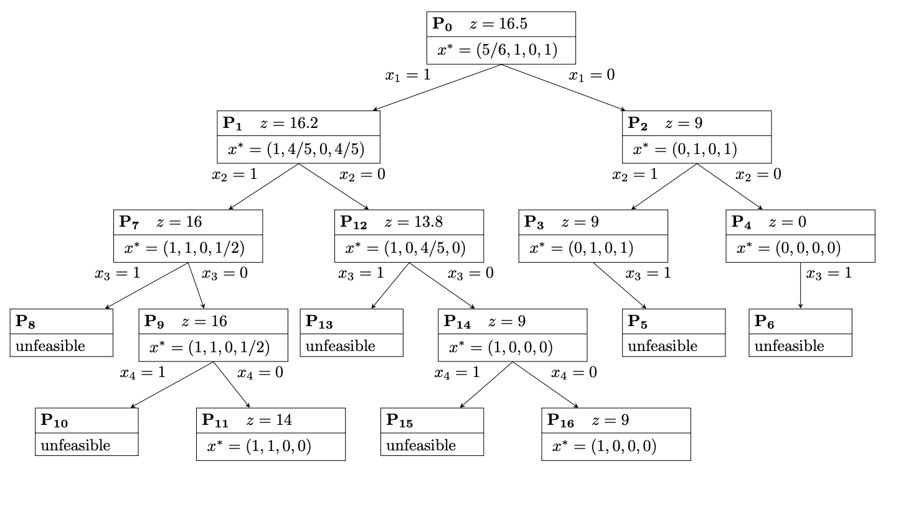
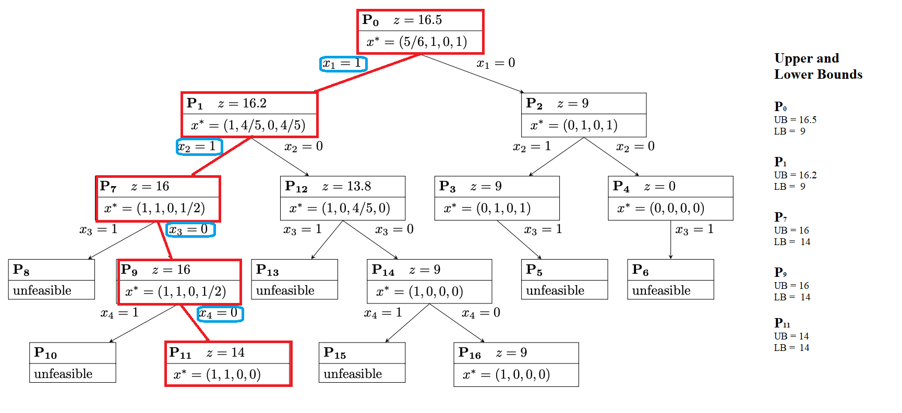
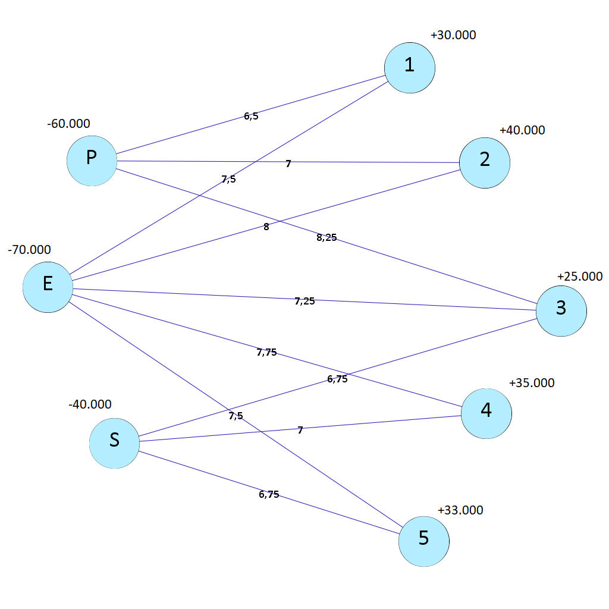
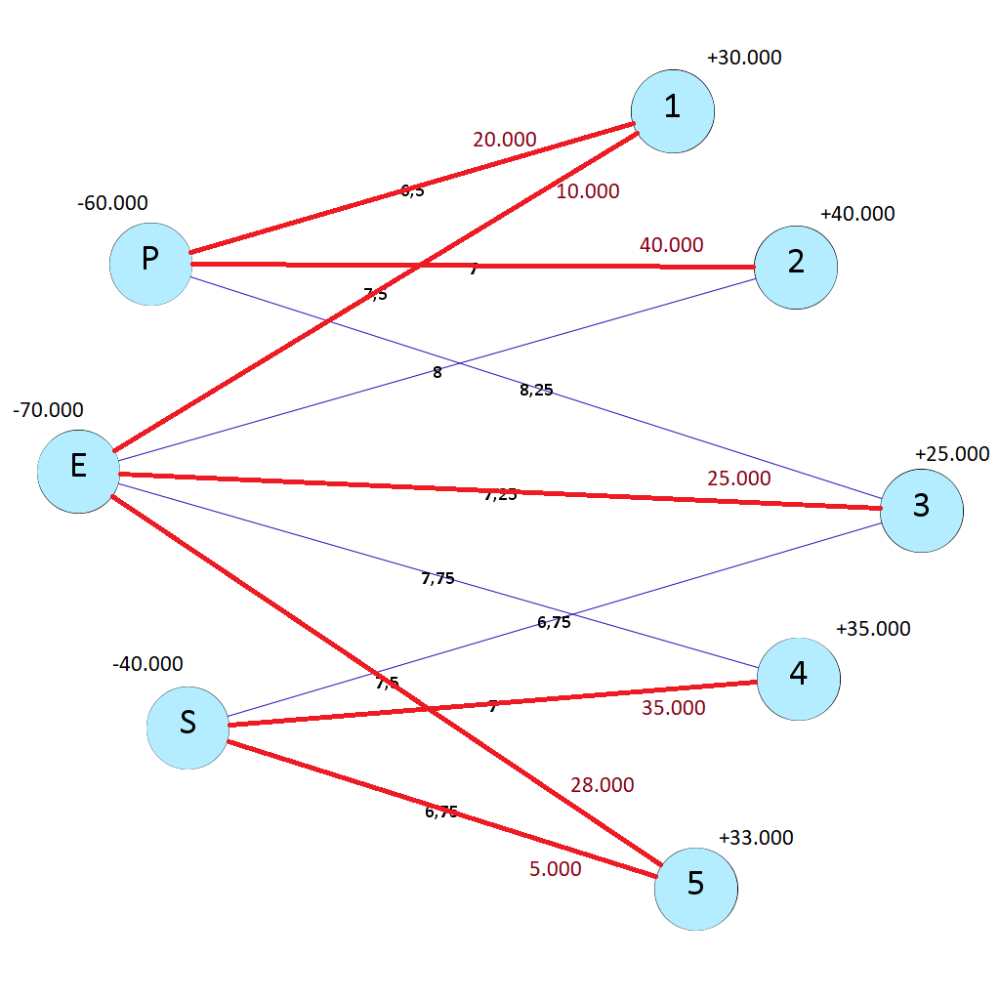

```{r setup, include=FALSE}
# Use 'verbatim = TRUE' as chunk option to show chunk code as is
require(knitr)
knitr::opts_chunk$set(warning = FALSE, message = FALSE)
hook_source_def = knit_hooks$get('source')
knit_hooks$set(source = function(x, options){
  if (!is.null(options$verbatim) && options$verbatim){
    opts = gsub(",\\s*verbatim\\s*=\\s*TRUE\\s*", "", options$params.src)
    bef = sprintf('\n\n    ```{r %s}\n', opts, "\n")
    stringr::str_c(bef, paste(knitr:::indent_block(x, "    "), collapse = '\n'), "\n    ```\n")
  } else {
     hook_source_def(x, options)
  }
})
```


## Problem 1
Consider the following ILP:

$$
\begin{aligned}
&\max \quad 9 x_{1}+5 x_{2}+6 x_{3}+4 x_{4}\\
&\text { s.t. } \quad \\
&6 x_{1}+3 x_{2}+5 x_{3}+2 x_{4} \leq 10, \\
&x_{3}+x_{4} \leq 1,\\
&-x_{1}+x_{3} \leq 0,\\
&-x_{2}+x_{4} \leq 0\\
&x_{1}, x_{2}, x_{3}, x_{4} \in\{0,1\}
\end{aligned}
$$

The following tree represents the solutions of all possible relaxations of the problem in which no sub-problem has been excluded (fathoming).


<center>
{width=700px}

</center>
<br>
<br>

Suppose that the Branch and Bound (BB) algorithm applies to this problem. Also, let's suppose that the algorithm visits the sub-problems in the following order P0 , P1 , . . . , P16. Clearly, the algorithm does not visit all nodes. 


__1) Determine the nodes that will be visited by the BB algorithm and for each of them get the upper and lower limit deduced by the algorithm in the execution.__

<center>
{width=800px}


</center>

The upper bounds are obtained using relaxed solutions, and lower bounds by rounding down the variables and subsequently calculating the value of the objective function, as recommended on page C-5 in the [following textbook](http://web.tecnico.ulisboa.pt/mcasquilho/compute/_linpro/TaylorB_module_c.pdf).  


**2) Solve the problem with an ILP solver and check the value of the objective function matches the one found at point 1.**


### Model
```{r results=FALSE, message=FALSE, warning=FALSE, paged.print=FALSE}

library(lpSolveAPI)

model = make.lp(0,4)

name.lp(model, "Problem 1")

lp.control(model, sense = "max")

set.objfn(model, obj = c(9,5,6,4))

```
### Contraints
```{r}
add.constraint (model,
               xt = c(6,3,5,2),
               type = "<=",
               rhs = 10,
               indices = c(1,2,3,4))

add.constraint (model,
               xt = c(1,1),
               type = "<=",
               rhs = 1,
               indices = c(3,4))

add.constraint (model,
               xt = c(-1,1),
               type = "<=",
               rhs = 0,
               indices = c(1,3))

add.constraint (model,
               xt = c(-1,1),
               type = "<=",
               rhs = 0,
               indices = c(2,4))

set.type(model, c(1:4), "binary") # x1, x2, x3, x4 in {0,1}
```
### Solution

```{r}
solve (model)

get.objective(model)

get.variables(model)


```
The objective function, as well as the values of decision variables, obtained by solving the model are the same as those obtained by solving the the point one, i.e.: 
$$
\begin{aligned}
&Z = 14 ,
&x_{1} = 1,\:\: \: \:\: \: &x_{2} = 1,
&x_{3} = 0, \:\: \:\:\: \:
&x_{4} = 0 \\
\end{aligned}
$$


## Problem 2

SunNet is a residential Internet Service Provider (ISP) in the central Florida area.
Presently, the company operates one centralized facility that all of its clients call into for Internet access. 

To improve service, the company is planning to open three satellite offices in the cities of Pine Hills, Eustis, and Sanford. 
The company has identified five different regions to be serviced by these three offices. 
The following table summarizes the number of customers in each region, the service capacity at each office, and the monthly average cost per customer for providing the service to each region from each office. Table entries of “n.a.” indicate infeasible region-to-service center combinations. 

SunNet would like to determine how many customers from each region to assign to each service center to minimize the total cost.

$$
\begin{array}{lllll}
\text { Region } & \text { Pine Hills } & \text { Eustis } & \text { Sanford } & \text { Customers } \\ 
1 & \$ 6.50 & \$ 7.50 & \text { n.a. } & 30,000 \\ 
2 & \$ 7.00 & \$ 8.00 & \text { n.a. } & 40,000 \\ 
3 & \$ 8.25 & \$ 7.25 & \$ 6.75 & 25,000 \\ 
4 & \text { n.a. } & \$ 7.75 & \$ 7.00 & 35,000 \\ 
5 & \text { n.a. } & \$ 7.50 & \$ 6.75 & 33,000 \\ 
\hline
\text { Capacity } & 60,000 & 70,000 & 40,000 & 
\end{array}
$$
**1) Draw a network flow model to represent this problem.**

### Network Flow Model Graph

<center> 



</center> 

**2) Implement your model and solve it.**

### Model:

#### Decision Variables

$x_{i,j}$ number of clients supplied from provider i to region j.

$i \in \{p,e,s\},$
$j \in \{1,2,3,4,5\}$.

#### Objective Function

$$   min: \;  6.5\,x_{p1} + 7\,x_{p2} + 8.25 \,x_{p3}\\ 
 + 7.5 \,x_{e1} + 8 \,x_{e2} + 7.25 \,x_{e3} + 7.75 \,x_{e4} + 7.5 \,x_{e5}\\
+ 6.75 \,x_{s3} + 7 \,x_{s4} + 6.75 \,x_{s5}$$

#### Constraints 

**Supply constraints**

$$\begin{align}
\sum_{j=1}^{3} x_{pj} \le 60000\\ 
\sum_{j=1}^{5} x_{ej} \le 70000\\
\sum_{j=3}^{5} x_{sj} \le 40000\\
\end{align}\\$$

**Demand constraints**
$$\begin{align}
\sum_{i \in \{p,e\}} x_{i1} = 30000\\
\sum_{i \in \{p,e\}} x_{i2} = 40000\\
\sum_{i \in \{p,e,s\}} x_{i3} = 25000\\
\sum_{i \in \{e,s\}} x_{i4} = 35000\\
\sum_{i \in \{e,s\}} x_{i5} = 30000\\
\end{align}\\$$

In addition, the decision variables have to be integers and non negative:
$$\begin{align}
x_{ij} \in Z\\
x_{ij} \ge 0
\end{align}
\\$$

```{r results=FALSE, message=FALSE, warning=FALSE, paged.print=FALSE}

edges <- data.frame(index_i=  c("p","p","p",  "e","e","e","e","e",  "s","s","s" ),
                     index_j =c( 1,  2,  3,    1,  2,  3,  4,  5,    3,  4,  5),
                     coeff = c (6.5,7, 8.25, 7.5, 8, 7.25,7.75,7.5, 6.75,7,6.75))

edges

model <- make.lp(0,11)

name.lp(model, "Problem 2")

lp.control(model, sense="min")

set.objfn(model, edges$coeff)

# CONSTRAINTS

## SUPPLY CONSTRAINTS

add.constraint(model,
               xt = c(1,1,1),
               type = "<=",
               rhs = 60000,
               indices = c(1,2,3)) # Supply from P

add.constraint(model,
               xt = c(1,1,1,1,1),
               type = "<=",
               rhs = 70000,
               indices = c(4,5,6,7,8)) # Supply from E

add.constraint(model,
               xt = c(1,1,1),
               type = "<=",
               rhs = 40000,
               indices = c(9,10,11)) # Supply from S

## DEMAND CONSTRAINTS

add.constraint(model,
               xt = c(1,1),
               type = "=",
               rhs = 30000,
               indices = c(1,4)) # Demand region 1

add.constraint(model,
               xt = c(1,1),
               type = "=",
               rhs = 40000,
               indices = c(2,5)) # Demand region 2

add.constraint(model,
               xt = c(1,1,1),
               type = "=",
               rhs = 25000,
               indices = c(3,6,9)) # Demand region 3

add.constraint(model,
               xt = c(1,1),
               type = "=",
               rhs = 35000,
               indices = c(7,10)) # Demand region 4

add.constraint(model,
               xt = c(1,1),
               type = "=",
               rhs = 33000,
               indices = c(8,11)) # Demand region 5


set.type (model, cbind(edges$index_i,edges$index_j), "integer")

set.bounds(model,c(rep(0,11)))

solve(model)
```
**3) What is the optimal solution?**

### Optimal solution

The amount of the total cost for the SunNet is 1155000.

```{r}
get.objective(model)
```
The number of customers from each region assigned to each service center in order to minimize the cost is as follows:

```{r}
v <- get.variables(model); v

res<-cbind(edges, v)[c("index_i", "index_j", "v")]

res[res$v !='0',]
```

<center> 

</center> 

